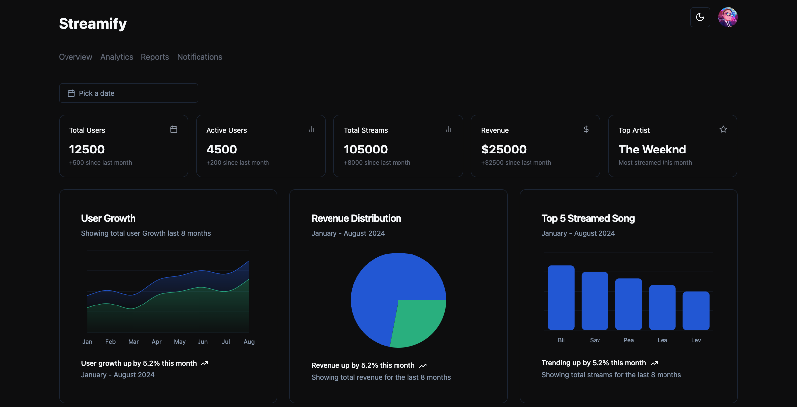

# React + TypeScript + Vite

# Streamify Analytics Dashboard



## Table of Contents

- [Introduction](#introduction)
- [Features](#features)
- [Folder Structure](#folder-structure)
- [Setup](#setup)
  - [Prerequisites](#prerequisites)
  - [Installation](#installation)
- [Usage](#usage)
  - [Development Server](#development-server)
  - [Building for Production](#building-for-production)
- [Testing](#testing)
- [Technologies Used](#technologies-used)
- [Contributing](#contributing)
- [License](#license)

## Introduction

Streamify is a comprehensive analytics dashboard designed to provide insightful views on user metrics and content performance. It offers detailed data visualizations that help users track growth, revenue, and streaming metrics effortlessly.

## Features

- **User Growth Metrics:** Track growth and engagement with total and active user metrics over time.
- **Revenue Distribution:** Detailed view of revenue streams from subscriptions and ads.
- **Top Streamed Songs:** Insights into the most streamed songs over a specific period.
- **Responsive Design:** A seamless experience across all devices.

## Folder Structure

```plaintext
src/
├── assets              # Static assets like images and fonts
├── components          # Reusable components
│   ├── charts          # Chart-specific components
│   ├── table           # Table-specific components
│   ├── ui              # General UI components
│   │   ├── Charts.tsx         # Reusable chart components
│   │   ├── KeyMetrics.tsx     # Key Metrics card component
│   │   ├── MetricCard.tsx     # Metric Card component
│   │   ├── Toggle.tsx         # Toggle switch component
├── dashboard           # Dashboard-related components
├── data                # Data files and mock data
├── hooks               # Custom hooks
├── lib                 # Utility functions and libraries
├── theme               # Theming and styles
├── App.tsx             # Root component of the app
├── index.css           # Global styles
├── main.tsx            # Entry point of the application
├── vite-env.d.ts       # TypeScript environment declaration for Vite
```
